# Stripe-POC

## Overview

Proof of concept project to test [**Stripe's**](http://stripe.com) functionality.

Full project consist of two separate applications:
- **Functions** -- It's Firebase Function as backend to process Stripe functionality and secure Firebase Database manipulations
- **Frontend** -- Simple Angular 4/5 application with auth/home/private sections. It allows to add products, make offers and buy products. Simple **Shop** -- **Customer** relations.

To install each application, please check each folder and it's own readme files.

## General usage

1. Visit `Sign In` (Signup) section to create at least pair of users for testing purposes. (ex. Andy Garcia and Boris the Blade :D )

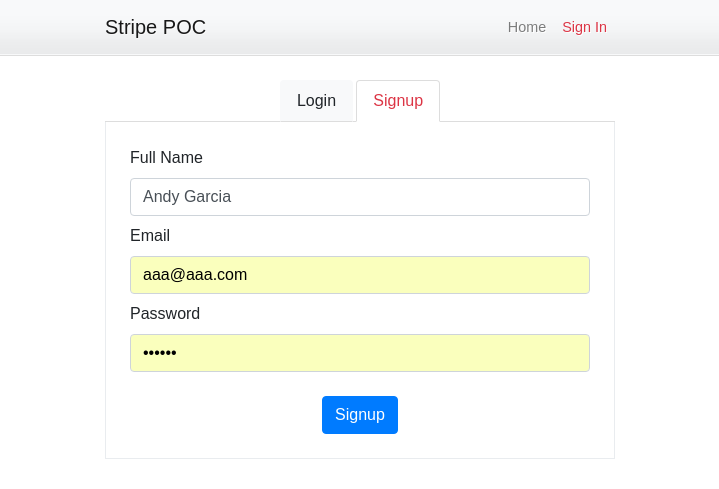

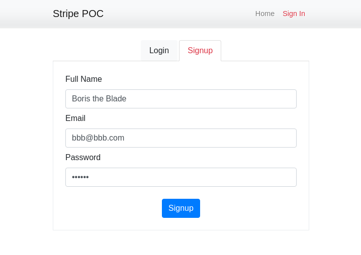

2. Make pair of Stripe accounts. [Create account](https://dashboard.stripe.com/register)

3. Edit user profiles: put Stripe keys details for each user.

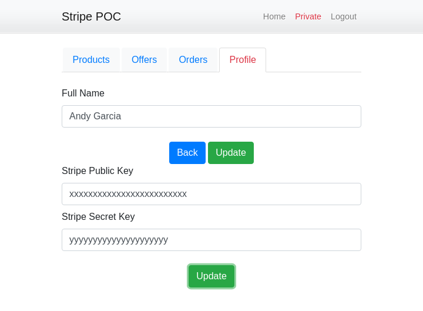

It will allow you to Make offer from **Andy** to **Boris** (or vice versa) and test purchase action from both sides (shop and customer points of view).

4. To make offer you need to have some **Product** item first. Now your product list is empty:

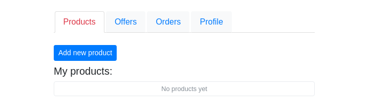

4.1. Let's add first one with name *Product for Boris* and $15 as a price:

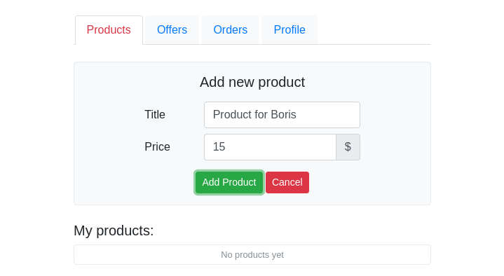

4.2. Cool! You have one product in the list.

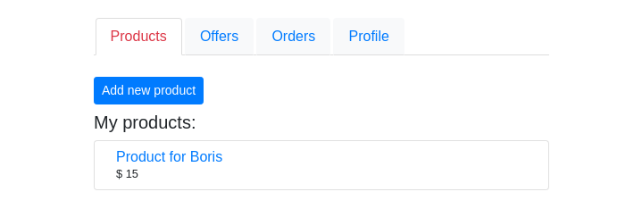

5. Now you can make an offer for Boris. Let's go to **Offers** page. Here you can see **User list** on left and each user has button to **make offer**. Also you can see a list of Offers you've made on right side. But no offers here yet:

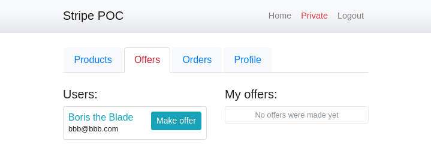

5.1. Let's make an offer with our product to Boris by clicking on **make offer** button next to his name. It will lead us to **Make offer form**. Here you can see User, which will receive an offer and Dropdown with a list of your products. Let's choose our 'Product for Boris':

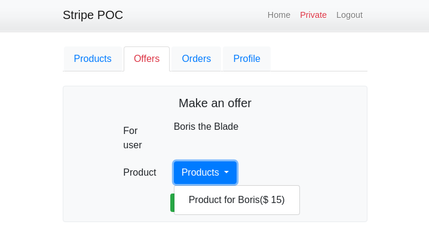

5.2. Now we have one active offer:

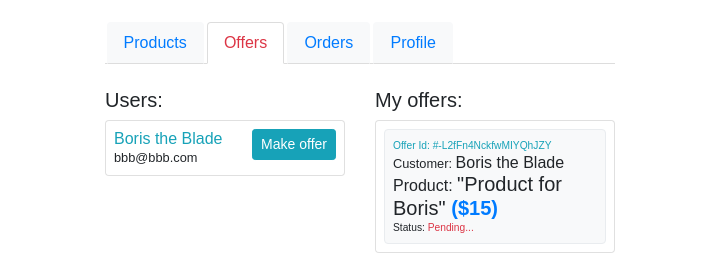

6. Let's check offers for Boris. Let's use his account and check **Order** section. On left side you can see offer from Andy and on left side you can see an empty list of purchased products:

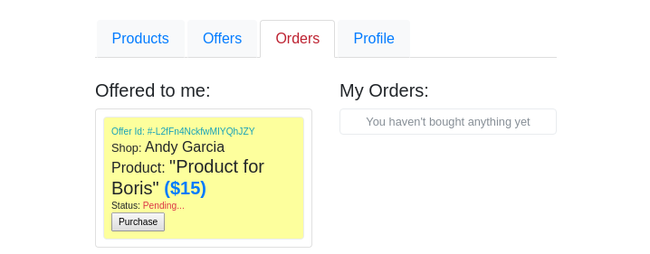

6.1. Let's accept this offer and purchase this very special product for Boris by clicking **Purchase** button. It will lead us to Stripe purchase form. Just fill it like on screen with **4242 4242 4242 4242** as CC and any digits for other fields:

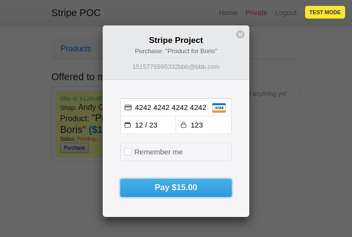

6.2. If stripe form will pass this without errors you will see your new product in list of orders on the right:

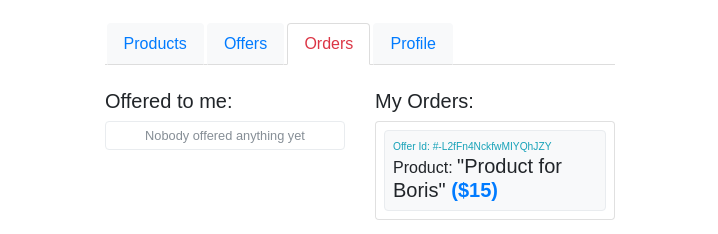

So we tested behaviors for Andy's as **Shop** and Boris' as **Customer**. First one added product and made offer, second purchased offered product with Stripe and got it in his order's list.
